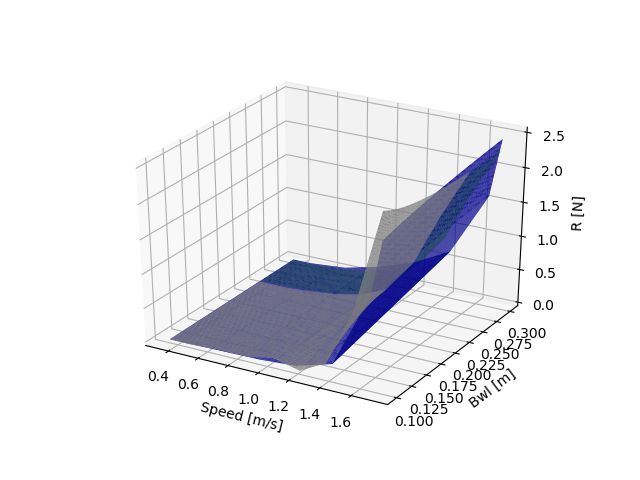
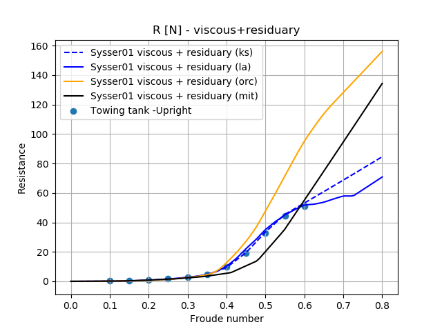
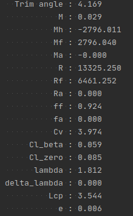

ydeos_hydrodynamics
===================

.. image:: https://travis-ci.org/ydeos/ydeos_hydrodynamics.svg?branch=main
    :target: https://travis-ci.org/ydeos/ydeos_hydrodynamics

.. image:: https://app.codacy.com/project/badge/Grade/d3c2100282924de69fc8eaa10adeb5b0
    :target: https://www.codacy.com/gh/ydeos/ydeos_hydrodynamics/dashboard?utm_source=github.com&amp;utm_medium=referral&amp;utm_content=ydeos/ydeos_hydrodynamics&amp;utm_campaign=Badge_Grade

.. image:: https://coveralls.io/repos/github/ydeos/ydeos_hydrodynamics/badge.svg?branch=main
    :target: https://coveralls.io/github/ydeos/ydeos_hydrodynamics?branch=main

**ydeos_hydrodynamics** is a collection of hydrodynamic models for yachts and ships.

- Friction resistance of hull and appendages using various friction lines
- Delft Series 3 (residual resistance / sailing yachts)
- Delft Series 4 (residual resistance / sailing yachts)
- Delft 2008 (residual resistance / sailing yachts)
- MIT (residual resistance)
- ORC (residual resistance / sailing yachts)
- Savitsky (planning hulls)
- Holtrop Mennen (ships)
- Sideforce model
- Righting moment estimates
- Heeled wetted area estimate
- Water characteristics

Install
-------

.. code-block:: shell

   git clone https://github.com/ydeos/ydeos_hydrodynamics
   cd ydeos_hydrodynamics
   python setup.py install

Examples
--------

See the examples_ folder.

   Delft model off-limits behavior (behavior_delft_off_limits.py_)

   Drag curves of a Delft model (SYSSER 1) (dsyhs_drag_example.py_)

   Savitsky planning hull method (savitsky_example.py_)

.. _examples: https://github.com/ydeos/ydeos_hydrodynamics/tree/main/examples
.. _behavior_delft_off_limits.py: https://github.com/ydeos/ydeos_hydrodynamics/tree/main/examples/behavior_delft_off_limits.py
.. _dsyhs_drag_example.py: https://github.com/ydeos/ydeos_hydrodynamics/tree/main/examples/dsyhs_drag_example.py
.. _savitsky_example.py: https://github.com/ydeos/ydeos_hydrodynamics/tree/main/examples/savitsky_example.py

Contribute
----------

Please open an issue if you find a bug or if you come up with ideas about how to improve the project.

Then: fork, feature branch and open a pull request. Feel free to contribute!

